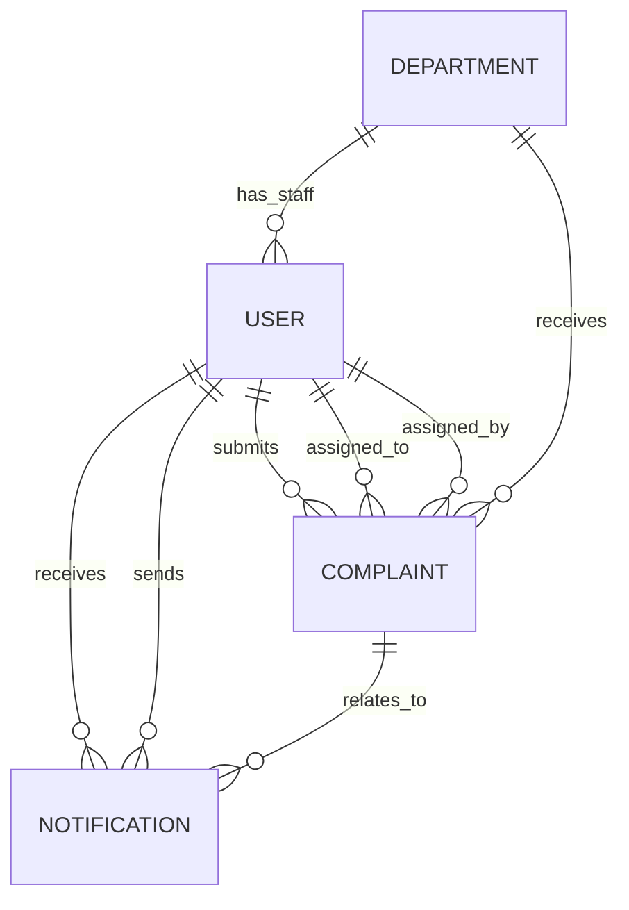

# PROJECT AUDIT

## 1. Project Overview

- **Project name:** UCMS (University Complaint Management System)
- **Purpose:** Role-based complaint lifecycle management for Users, Admins, and Staff.
- **Business problem solved:** Centralizes intake, triage, assignment, tracking, and completion of university complaints with visibility across roles.
- **Application type:** Internal operations platform / service desk workflow app (multi-role admin CRM-style system).
- **Current completion status (estimate):** **~72%** complete for local/dev workflows.
- **Missing major features:**
  - Production-grade email delivery and verification UX fallback hardening.
  - Complete analytics migration to backend APIs (still mock-driven in one page).
  - Audit logging / activity history per actor.
  - Centralized request validation/sanitization layer.
  - Monitoring, tracing, and deployment automation.
  - Robust test suite (unit/integration/E2E absent).

---

## 2. Tech Stack Analysis

### Frontend

- **React 19**
  - **Why:** SPA component model and ecosystem.
  - **Where:** [client/src/main.jsx](client/src/main.jsx), [client/src/App.jsx](client/src/App.jsx), feature pages/components.
  - **Connection:** Consumes backend APIs via Axios and server state via TanStack Query.

- **Vite**
  - **Why:** Fast dev/build tooling.
  - **Where:** [client/vite.config.js](client/vite.config.js), scripts in [client/package.json](client/package.json).
  - **Connection:** Builds frontend bundle and env injection via `VITE_*` vars.

- **React Router**
  - **Why:** Role-based route segmentation and guarded navigation.
  - **Where:** [client/src/App.jsx](client/src/App.jsx), [client/src/routes/AuthGuard.jsx](client/src/routes/AuthGuard.jsx), [client/src/routes/RequireAuth.jsx](client/src/routes/RequireAuth.jsx).
  - **Connection:** Coordinates auth state from Redux and role redirects.

- **Redux Toolkit**
  - **Why:** Auth session state persistence (user/token/role/isAuthenticated).
  - **Where:** [client/src/store.js](client/src/store.js), [client/src/features/auth/authSlice.js](client/src/features/auth/authSlice.js), [client/src/features/auth/authStorage.js](client/src/features/auth/authStorage.js).
  - **Connection:** Axios interceptor reads token from store.

- **TanStack Query**
  - **Why:** Server-state caching and mutation flows.
  - **Where:** [client/src/lib/queryClient.js](client/src/lib/queryClient.js), `useQuery`/`useMutation` hooks in feature folders.
  - **Connection:** Wraps API modules (`userApi`, `adminApi`, `staffApi`) and invalidates query keys.

- **Tailwind CSS + shadcn-style UI + Base UI**
  - **Why:** Rapid UI composition with reusable primitives.
  - **Where:** [client/src/index.css](client/src/index.css), [client/src/components/ui](client/src/components/ui), [client/components.json](client/components.json).
  - **Connection:** Shared design tokens consumed by page/components.

- **Axios**
  - **Why:** HTTP client with interceptors and `withCredentials`.
  - **Where:** [client/src/lib/apiClient.js](client/src/lib/apiClient.js).
  - **Connection:** Talks to backend `/api/*` endpoints.

- **Socket.IO client**
  - **Why:** Realtime updates (complaint + notifications).
  - **Where:** [client/src/lib/socket.js](client/src/lib/socket.js), initialized in [client/src/App.jsx](client/src/App.jsx).
  - **Connection:** Auth token passed in socket handshake.

### Backend

- **Node.js + Express 5**
  - **Why:** REST API, middleware pipeline, role-based routing.
  - **Where:** [server/server.js](server/server.js), route/controller folders.
  - **Connection:** Exposes `/api/auth`, `/api/user`, `/api/complaints`, `/api/admin`, `/api/staff`.

- **MongoDB + Mongoose**
  - **Why:** Document modeling for users/complaints/departments/notifications.
  - **Where:** [server/config/db.js](server/config/db.js), [server/models](server/models).
  - **Connection:** Controllers query/update models; aggregations power analytics.

- **Authentication (JWT + cookie + bearer)**
  - **Why:** Session auth for protected API and socket context.
  - **Where:** [server/utils/generateToken.js](server/utils/generateToken.js), [server/middleware/auth.middleware.js](server/middleware/auth.middleware.js).
  - **Connection:** Token set as httpOnly cookie and also returned to frontend.

- **Nodemailer**
  - **Why:** Verification and reset emails.
  - **Where:** [server/utils/sendEmail.js](server/utils/sendEmail.js), [server/controllers/auth.controller.js](server/controllers/auth.controller.js).
  - **Connection:** Uses SMTP config or Ethereal fallback in dev.

- **Cloudinary + Multer**
  - **Why:** Attachment/proof upload handling.
  - **Where:** [server/middleware/upload.middleware.js](server/middleware/upload.middleware.js), [server/config/cloudinary.js](server/config/cloudinary.js).
  - **Connection:** Uploaded files are attached to complaint docs.

- **Socket.IO server**
  - **Why:** Realtime events to admins/users/staff.
  - **Where:** [server/socket/socket.js](server/socket/socket.js).
  - **Connection:** Controller emits (`complaint:new`, `complaint:assigned`, etc.).

- **Security middleware**
  - **Why:** Basic hardening + logging.
  - **Where:** `helmet`, `cors`, `cookie-parser`, `morgan` in [server/server.js](server/server.js).
  - **Connection:** Applied globally before routes.

### Deployment / environment

- **Current state:** Local-dev oriented; no container manifests, CI/CD, or process manager config.
- **Evidence:** No Docker/compose/Procfile/CI files found from project root scan.

---

## 3. Project Structure Analysis

### Complete folder tree (excluding `.git` and `node_modules`)

```text
.
FRONTEND_DOCUMENTATION.md
README.md
PROJECT_AUDIT.md
client/
  .env
  .gitignore
  README.md
  components.json
  eslint.config.js
  index.html
  jsconfig.json
  package-lock.json
  package.json
  vite.config.js
  public/
    favicon.svg
    icons.svg
  dist/
    index.html
    favicon.svg
    icons.svg
    assets/*
  src/
    App.jsx
    main.jsx
    index.css
    store.js
    assets/
    routes/
      AuthGuard.jsx
      RequireAuth.jsx
    pages/
      AdminDashboardPage.jsx
      StaffDashboardPage.jsx
      UserDashboardPage.jsx
      RoleDashboardPage.jsx
    constants/
      navigationAdmin.js
      navigationStaff.js
      navigationUser.js
      statusMap.js
      theme.js
    hooks/
      use-mobile.js
    lib/
      apiClient.js
      queryClient.js
      socket.js
      utils.js
    mock/
      index.js
      complaints.js
      departments.js
      notifications.js
      admin.js
      staff.js
    components/
      AppHeader.jsx
      AppSidebar.jsx
      shared/
        FormFieldWrapper.jsx
        PageShell.jsx
        index.js
      ui/
        alert-dialog.jsx
        avatar.jsx
        badge.jsx
        breadcrumb.jsx
        button.jsx
        card.jsx
        chart.jsx
        checkbox.jsx
        dialog.jsx
        dropdown-menu.jsx
        form.jsx
        input.jsx
        label.jsx
        pagination.jsx
        popover.jsx
        progress.jsx
        scroll-area.jsx
        select.jsx
        separator.jsx
        sheet.jsx
        sidebar.jsx
        skeleton.jsx
        switch.jsx
        table.jsx
        tabs.jsx
        textarea.jsx
        toast.jsx
        tooltip.jsx
    features/
      auth/
        authApi.js
        authSchemas.js
        authSlice.js
        authStorage.js
        hooks/*
        components/*
        pages/*
      user/
        userApi.js
        userData.js
        userQueryKeys.js
        constants.js
        schemas.js
        utils.js
        hooks/*
        components/*
        pages/*
      admin/
        adminApi.js
        adminQueryKeys.js
        constants.js
        components/*
        pages/*
      staff/
        staffApi.js
        staffQueryKeys.js
        constants.js
        components/*
        pages/*
server/
  .env
  .env.example
  .gitignore
  package-lock.json
  package.json
  server.js
  config/
    db.js
    cloudinary.js
    nodemailer.js
  middleware/
    auth.middleware.js
    role.middleware.js
    upload.middleware.js
    error.middleware.js
    rateLimiter.middleware.js
  models/
    User.model.js
    Department.model.js
    Complaint.model.js
    Notification.model.js
  routes/
    auth.routes.js
    user.routes.js
    complaint.routes.js
    admin.routes.js
    staff.routes.js
  controllers/
    auth.controller.js
    user.controller.js
    complaint.controller.js
    admin.controller.js
    staff.controller.js
  socket/
    socket.js
  utils/
    apiResponse.js
    asyncHandler.js
    generateToken.js
    sendEmail.js
```

### Folder purpose and important file purpose

- `client/src/features/*`: Role and domain modules.
- `client/src/components/ui/*`: Generated primitive UI building blocks.
- `client/src/lib/apiClient.js`: Shared HTTP client and auth interceptor.
- `server/controllers/*`: Business logic per domain.
- `server/routes/*`: API route registration and middleware gating.
- `server/models/*`: Data schema and persistence constraints.
- `server/middleware/*`: Auth, role, uploads, error handling, rate limit definitions.
- `server/socket/socket.js`: realtime auth/room join + socket bootstrap.

### Dead/unnecessary and duplicate logic/files

- **Legacy duplicate pages:** [client/src/pages](client/src/pages) duplicates dashboard concepts already implemented under `features/*/pages` and is not used by routing in [client/src/App.jsx](client/src/App.jsx).
- **Mock data still present:** [client/src/mock](client/src/mock) and [client/src/features/user/userData.js](client/src/features/user/userData.js) remain despite API migration.
- **Conflicting mail config layer:** [server/config/nodemailer.js](server/config/nodemailer.js) is not used by current send path in [server/utils/sendEmail.js](server/utils/sendEmail.js).
- **Build artifact committed:** [client/dist](client/dist) is checked in, increasing repo noise and merge churn.

---

## 4. Frontend Audit

### Global layout / navigation / protection

- **Global layout:** role layouts in [client/src/features/user/components/UserLayout.jsx](client/src/features/user/components/UserLayout.jsx), [client/src/features/admin/components/AdminLayout.jsx](client/src/features/admin/components/AdminLayout.jsx), [client/src/features/staff/components/StaffLayout.jsx](client/src/features/staff/components/StaffLayout.jsx).
- **Header/sidebar:** [client/src/components/AppHeader.jsx](client/src/components/AppHeader.jsx), [client/src/components/AppSidebar.jsx](client/src/components/AppSidebar.jsx).
- **Route protection:** [client/src/routes/AuthGuard.jsx](client/src/routes/AuthGuard.jsx), [client/src/routes/RequireAuth.jsx](client/src/routes/RequireAuth.jsx).
- **Role-based rendering:** route-level allowedRoles in [client/src/App.jsx](client/src/App.jsx).
- **Theme handling:** tokenized in [client/src/index.css](client/src/index.css), utility maps in [client/src/constants/theme.js](client/src/constants/theme.js).

### Page-by-page audit

| Route                                                  | File                                                                                                                         | Purpose                        | APIs / State                                     | Findings                                                                                          |
| ------------------------------------------------------ | ---------------------------------------------------------------------------------------------------------------------------- | ------------------------------ | ------------------------------------------------ | ------------------------------------------------------------------------------------------------- |
| `/login`                                               | [client/src/features/auth/pages/LoginPage.jsx](client/src/features/auth/pages/LoginPage.jsx) + form                          | Authenticate user              | Redux auth slice, `useLogin`                     | Good UX; no brute-force UI delay; depends on backend limiter not mounted.                         |
| `/register`                                            | [client/src/features/auth/pages/RegisterPage.jsx](client/src/features/auth/pages/RegisterPage.jsx)                           | Register user                  | `useRegister`                                    | Payload includes `role` from frontend API helper (should be server-owned).                        |
| `/email-verification` and `/email-verification/:token` | [client/src/features/auth/pages/EmailVerificationPage.jsx](client/src/features/auth/pages/EmailVerificationPage.jsx)         | Verify/resend                  | `useVerifyEmail`, `useResendVerification`        | `useEffect` dependency list incomplete; resend disabled when email missing (good).                |
| `/forgot-password`                                     | [client/src/features/auth/pages/ForgotPasswordPage.jsx](client/src/features/auth/pages/ForgotPasswordPage.jsx)               | Reset request                  | `useForgotPassword`                              | Standard.                                                                                         |
| `/reset-password/:token`                               | [client/src/features/auth/pages/ResetPasswordPage.jsx](client/src/features/auth/pages/ResetPasswordPage.jsx)                 | Set new password               | `useResetPassword`                               | Standard.                                                                                         |
| `/user/dashboard`                                      | [client/src/features/user/pages/UserDashboardPage.jsx](client/src/features/user/pages/UserDashboardPage.jsx)                 | User stats + recent complaints | `useUserDashboard`, `useUserComplaints`          | Sorting done client-side; acceptable for small data.                                              |
| `/user/complaints`                                     | [client/src/features/user/pages/ComplaintListPage.jsx](client/src/features/user/pages/ComplaintListPage.jsx)                 | List/filter complaints         | `useUserComplaints`                              | **Bug risk:** backend route exposes `/complaints/me`, but API client calls `/complaints`.         |
| `/user/complaints/create`                              | [client/src/features/user/pages/CreateComplaintPage.jsx](client/src/features/user/pages/CreateComplaintPage.jsx)             | create/edit complaint          | `useCreateComplaint`, `useUpdateComplaint`       | Uses route state for edit; deep-link edit not supported.                                          |
| `/user/complaints/:id`                                 | [client/src/features/user/pages/ComplaintDetailsPage.jsx](client/src/features/user/pages/ComplaintDetailsPage.jsx)           | complaint detail               | `useComplaintDetails`                            | Good attachment handling; status normalize relies on mapping consistency.                         |
| `/user/profile`                                        | [client/src/features/user/pages/ProfilePage.jsx](client/src/features/user/pages/ProfilePage.jsx)                             | user profile                   | `fetchUserProfile`, `useUpdateProfile`           | Only updates full name; phone omitted although backend supports phone.                            |
| `/user/notifications`                                  | [client/src/features/user/pages/NotificationsPage.jsx](client/src/features/user/pages/NotificationsPage.jsx)                 | view/read notifications        | `fetchUserNotifications`, `markNotificationRead` | Works, but no pagination/infinite scroll.                                                         |
| `/admin/dashboard`                                     | [client/src/features/admin/pages/AdminDashboardPage.jsx](client/src/features/admin/pages/AdminDashboardPage.jsx)             | admin KPI cards                | `fetchAdminDashboard`                            | **Data mapping bug:** reads envelope as raw stats (`stats[card.key]`) instead of `response.data`. |
| `/admin/complaints`                                    | [client/src/features/admin/pages/AdminComplaintsQueuePage.jsx](client/src/features/admin/pages/AdminComplaintsQueuePage.jsx) | pending queue                  | `fetchPendingComplaints`                         | **Data mapping bug:** treats query result as array, but API returns envelope.                     |
| `/admin/complaints/:id`                                | [client/src/features/admin/pages/AdminComplaintDetailPage.jsx](client/src/features/admin/pages/AdminComplaintDetailPage.jsx) | approve/reject/assign          | multiple admin mutations                         | Strong workflow controls; no optimistic lock/version check.                                       |
| `/admin/staff`                                         | [client/src/features/admin/pages/StaffManagementPage.jsx](client/src/features/admin/pages/StaffManagementPage.jsx)           | CRUD staff                     | staff/department APIs                            | Inputs use raw HTML controls; validation mostly manual and minimal.                               |
| `/admin/analytics`                                     | [client/src/features/admin/pages/AdminAnalyticsPage.jsx](client/src/features/admin/pages/AdminAnalyticsPage.jsx)             | analytics                      | **mock only** imports from `@/mock`              | Not connected to backend analytics endpoint; stale architecture.                                  |
| `/admin/profile`                                       | [client/src/features/admin/pages/AdminProfilePage.jsx](client/src/features/admin/pages/AdminProfilePage.jsx)                 | profile                        | user profile APIs                                | Fine.                                                                                             |
| `/staff/dashboard`                                     | [client/src/features/staff/pages/StaffDashboardPage.jsx](client/src/features/staff/pages/StaffDashboardPage.jsx)             | staff KPI cards                | `fetchStaffDashboard`                            | **Data mapping bug** same as admin dashboard.                                                     |
| `/staff/complaints`                                    | [client/src/features/staff/pages/AssignedComplaintsPage.jsx](client/src/features/staff/pages/AssignedComplaintsPage.jsx)     | assigned complaints            | `fetchAssignedComplaints`                        | Good baseline.                                                                                    |
| `/staff/complaints/:id`                                | [client/src/features/staff/pages/StaffComplaintDetailPage.jsx](client/src/features/staff/pages/StaffComplaintDetailPage.jsx) | start/complete/proof           | staff mutations                                  | No guard against invalid status transitions from UI side.                                         |
| `/staff/profile`                                       | [client/src/features/staff/pages/StaffProfilePage.jsx](client/src/features/staff/pages/StaffProfilePage.jsx)                 | profile                        | user profile APIs                                | Fine.                                                                                             |

### Frontend security concerns

- Auth token stored in local/session storage via [client/src/features/auth/authStorage.js](client/src/features/auth/authStorage.js) (**XSS blast radius increase**).
- Server returns token in response and sets cookie, while client also sends bearer header: dual strategy can drift.
- No CSP configuration at frontend build/proxy layer (backend has default helmet CSP).

### Frontend performance concerns

- Committed production bundle in `client/dist` indicates no clean artifact strategy.
- Table pages load full datasets without pagination.
- React Query key usage inconsistent (`["user-complaints"]` invalidation vs structured keys).

---

## 5. Components Audit

### Reusable shell components

1. **AppHeader** — [client/src/components/AppHeader.jsx](client/src/components/AppHeader.jsx)
   - Purpose: role-aware breadcrumb/header/user menu.
   - Props: `roleName`, `rolePrefix`, `navItems`.
   - Internal logic: derives breadcrumbs from pathname, static notification menu.
   - Reusability score: **8/10**.
   - Problems: notifications currently hardcoded; logout does not call backend logout endpoint.
   - Improvement: connect to notifications query + `/auth/logout` call.

2. **AppSidebar** — [client/src/components/AppSidebar.jsx](client/src/components/AppSidebar.jsx)
   - Purpose: grouped role nav and profile/logout footer.
   - Props: `navItems`, `roleName`, `rolePrefix`.
   - Reusability score: **8/10**.
   - Problems: profile button uses `<button asChild>` pattern indirectly; mixed semantics.
   - Improvement: normalize button/link semantics and extract menu item component.

3. **PageShell** — [client/src/components/shared/PageShell.jsx](client/src/components/shared/PageShell.jsx)
   - Purpose: standardized page title/subtitle/actions.
   - Reusability score: **9/10**.

4. **FormFieldWrapper** — [client/src/components/shared/FormFieldWrapper.jsx](client/src/components/shared/FormFieldWrapper.jsx)
   - Purpose: label/hint/error wrapper.
   - Reusability score: **9/10**.

### Domain reusable components

- **ComplaintForm** ([client/src/features/user/components/ComplaintForm.jsx](client/src/features/user/components/ComplaintForm.jsx))
  - Good schema-driven validation and file handling.
  - Reusability score: **8/10**.
- **ComplaintTable** ([client/src/features/user/components/ComplaintTable.jsx](client/src/features/user/components/ComplaintTable.jsx))
  - Useful table shell + skeleton.
  - Reusability score: **7/10** (hardcoded columns/action assumptions).
- **ProfileForm** ([client/src/features/user/components/ProfileForm.jsx](client/src/features/user/components/ProfileForm.jsx))
  - Reused across roles.
  - Reusability score: **8/10**.

### UI primitive layer

- Folder [client/src/components/ui](client/src/components/ui) includes ~28 shadcn/base-ui wrappers.
- Mostly generated, cohesive, and reusable.
- Notable custom logic components: `sidebar`, `button`, `toast`.
- `toast` is simple and effective but lacks stacking limits and escape key handling.

---

## 6. Backend Audit

### Architecture

- Entry point: [server/server.js](server/server.js).
- Middleware chain: `helmet` → `morgan` → `express.json/urlencoded` → `cookieParser` → `cors` → routes → `errorHandler`.
- Route structure:
  - `/api/auth` → [server/routes/auth.routes.js](server/routes/auth.routes.js)
  - `/api/user` → [server/routes/user.routes.js](server/routes/user.routes.js)
  - `/api/complaints` → [server/routes/complaint.routes.js](server/routes/complaint.routes.js)
  - `/api/admin` → [server/routes/admin.routes.js](server/routes/admin.routes.js)
  - `/api/staff` → [server/routes/staff.routes.js](server/routes/staff.routes.js)
- Controllers: auth, user, complaint, admin, staff.
- Services layer: **not present** (logic embedded directly in controllers).
- Validation layer: mostly manual `if (!field)` checks; no centralized request schema middleware.
- Error handling: centralized handler in [server/middleware/error.middleware.js](server/middleware/error.middleware.js).

### API catalog

#### Auth APIs

| Method | Route                                 | Purpose                           | Auth | Role   |
| ------ | ------------------------------------- | --------------------------------- | ---- | ------ |
| POST   | `/api/auth/register`                  | Register user + send verification | No   | Public |
| POST   | `/api/auth/login`                     | Login + issue JWT                 | No   | Public |
| POST   | `/api/auth/logout`                    | Clear cookie                      | No   | Public |
| GET    | `/api/auth/email-verification/:token` | Verify email token                | No   | Public |
| POST   | `/api/auth/email-verification/:token` | Duplicate verify endpoint         | No   | Public |
| POST   | `/api/auth/resend-verification`       | Resend verify email               | No   | Public |
| POST   | `/api/auth/forgot-password`           | Request reset link                | No   | Public |
| POST   | `/api/auth/reset-password/:token`     | Reset password                    | No   | Public |
| GET    | `/api/auth/me`                        | Current profile                   | Yes  | Any    |

#### User APIs

| Method | Route                              | Purpose              | Auth | Role              |
| ------ | ---------------------------------- | -------------------- | ---- | ----------------- |
| GET    | `/api/user/profile`                | Fetch profile        | Yes  | Any authenticated |
| PUT    | `/api/user/profile`                | Update profile       | Yes  | Any authenticated |
| GET    | `/api/user/dashboard`              | User complaint stats | Yes  | Any authenticated |
| GET    | `/api/user/notifications`          | List notifications   | Yes  | Any authenticated |
| PATCH  | `/api/user/notifications/:id/read` | Mark read            | Yes  | Owner enforced    |

#### Complaint APIs

| Method | Route                 | Purpose                    | Auth | Role                                            |
| ------ | --------------------- | -------------------------- | ---- | ----------------------------------------------- |
| POST   | `/api/complaints`     | Create complaint (+upload) | Yes  | Any authenticated                               |
| GET    | `/api/complaints/me`  | List own complaints        | Yes  | Any authenticated                               |
| GET    | `/api/complaints/:id` | Get complaint              | Yes  | Any authenticated (authorization check partial) |
| PUT    | `/api/complaints/:id` | Update pending complaint   | Yes  | Owner only                                      |
| DELETE | `/api/complaints/:id` | Delete pending complaint   | Yes  | Owner only                                      |

#### Admin APIs

| Method | Route                               | Purpose              | Auth | Role  |
| ------ | ----------------------------------- | -------------------- | ---- | ----- |
| GET    | `/api/admin/dashboard`              | KPI dashboard        | Yes  | Admin |
| GET    | `/api/admin/complaints`             | All complaints       | Yes  | Admin |
| GET    | `/api/admin/complaints/pending`     | Pending queue        | Yes  | Admin |
| GET    | `/api/admin/complaints/:id`         | Complaint detail     | Yes  | Admin |
| POST   | `/api/admin/complaints/:id/approve` | Approve complaint    | Yes  | Admin |
| POST   | `/api/admin/complaints/:id/reject`  | Reject complaint     | Yes  | Admin |
| POST   | `/api/admin/complaints/:id/assign`  | Assign to staff      | Yes  | Admin |
| GET    | `/api/admin/staff`                  | Staff list           | Yes  | Admin |
| POST   | `/api/admin/staff`                  | Create staff         | Yes  | Admin |
| PUT    | `/api/admin/staff/:id`              | Update staff         | Yes  | Admin |
| DELETE | `/api/admin/staff/:id`              | Delete staff         | Yes  | Admin |
| POST   | `/api/admin/staff/:id/toggle`       | Toggle staff active  | Yes  | Admin |
| GET    | `/api/admin/departments`            | Departments list     | Yes  | Admin |
| POST   | `/api/admin/departments`            | Create department    | Yes  | Admin |
| GET    | `/api/admin/analytics`              | Aggregated analytics | Yes  | Admin |

#### Staff APIs

| Method | Route                              | Purpose                   | Auth | Role  |
| ------ | ---------------------------------- | ------------------------- | ---- | ----- |
| GET    | `/api/staff/dashboard`             | Staff KPI                 | Yes  | Staff |
| GET    | `/api/staff/assigned`              | Assigned complaints       | Yes  | Staff |
| GET    | `/api/staff/assigned/:id`          | Assigned complaint detail | Yes  | Staff |
| POST   | `/api/staff/assigned/:id/start`    | Move to in_progress       | Yes  | Staff |
| POST   | `/api/staff/assigned/:id/complete` | Complete complaint        | Yes  | Staff |
| POST   | `/api/staff/assigned/:id/proof`    | Upload proof              | Yes  | Staff |

### Backend weaknesses

- Business logic is controller-heavy with no service boundaries.
- Request validation is fragmented and inconsistent.
- Role normalization inconsistent across files (lowercase/uppercase mismatches).
- No transaction boundaries for multi-write operations (notifications + complaint updates).

---

## 7. Database Audit

### Models and fields

1. **User** — [server/models/User.model.js](server/models/User.model.js)
   - Fields: `fullName`, `email`, `password`, `role`, `department`, `avatar`, `phone`, `isEmailVerified`, verification/reset tokens, `isActive`, `lastLogin`, timestamps.
   - Constraints: `email` unique, `role` enum.
   - Hooks/methods: password hash pre-save; compare; token generators.

2. **Department** — [server/models/Department.model.js](server/models/Department.model.js)
   - Fields: `name`, `description`, `code`, `headOfDepartment`, `isActive`, timestamps.
   - Constraints: `name` unique, `code` unique.

3. **Complaint** — [server/models/Complaint.model.js](server/models/Complaint.model.js)
   - Fields: `complaintId`, `title`, `description`, `department`, `submittedBy`, `assignedTo`, `assignedBy`, `status`, `priority`, attachments, `rejectionReason`, proof, timeline, `resolvedAt`, timestamps.
   - Constraints: `complaintId` unique; status/priority enums.
   - Hook: generates human-readable complaint id.

4. **Notification** — [server/models/Notification.model.js](server/models/Notification.model.js)
   - Fields: `recipient`, `sender`, `type`, `title`, `message`, `complaintId`, `isRead`, timestamps.

### Relationships

- `User.department -> Department._id`
- `Complaint.department -> Department._id`
- `Complaint.submittedBy/assignedTo/assignedBy -> User._id`
- `Notification.recipient/sender -> User._id`
- `Notification.complaintId -> Complaint._id`

### Relationship mapping



### Index and normalization concerns

- Missing explicit indexes for high-frequency queries:
  - `Complaint.submittedBy + createdAt`
  - `Complaint.assignedTo + status`
  - `Complaint.status + createdAt`
  - `Notification.recipient + isRead + createdAt`
- Timeline/proof arrays can grow unbounded in single complaint documents.
- Department auto-create on complaint submission may generate noisy/duplicated departments (normalization risk).

---

## 8. Authentication & Authorization Audit

### Flows

- **Register:** creates user, generates verification token, stores hashed token/expiry, sends email.
- **Verify email:** token hash lookup, flips `isEmailVerified`.
- **Login:** checks email/password + verification + active status, issues JWT cookie and returns token.
- **Auth middleware:** accepts cookie token or Bearer token.

### Strengths

- Password hashing with bcrypt cost 12.
- Email verification required before login.
- Role middleware centralized in [server/middleware/role.middleware.js](server/middleware/role.middleware.js).

### Weaknesses

- No refresh token rotation strategy.
- JWT secret and credentials are present in env files in repository (critical operational weakness).
- Logout endpoint exists but client-side logout commonly only clears local auth state.
- Mixed cookie + bearer model increases complexity and risk of inconsistent auth behavior.
- Duplicate verification route (GET + POST same path).

---

## 9. State Management Audit

- **Redux usage:** auth only; concise and acceptable.
- **Store structure:** single `auth` slice in [client/src/store.js](client/src/store.js).
- **Persistence:** custom local/session storage strategy in [client/src/features/auth/authStorage.js](client/src/features/auth/authStorage.js).
- **Query caching:** TanStack Query across domain hooks.

### Findings

- Query invalidation keys inconsistent in places (`["user-complaints"]` vs structured key builders).
- Some pages parse API envelope correctly (`response?.data`), others do not.
- No global query error boundary / retry strategy tuning per endpoint class.

---

## 10. API Integration Audit

### Frontend-backend communication

- Central client in [client/src/lib/apiClient.js](client/src/lib/apiClient.js) with auth header injection and 401 logout.
- API wrappers by domain:
  - [client/src/features/auth/authApi.js](client/src/features/auth/authApi.js)
  - [client/src/features/user/userApi.js](client/src/features/user/userApi.js)
  - [client/src/features/admin/adminApi.js](client/src/features/admin/adminApi.js)
  - [client/src/features/staff/staffApi.js](client/src/features/staff/staffApi.js)

### Integration issues

- `fetchUserComplaints` calls `/complaints` but backend exposes `/complaints/me` (likely 404 path mismatch).
- Admin/staff dashboard pages misuse response envelope.
- Admin queue page also misuses response envelope.
- `AdminAnalyticsPage` still mock-driven and bypasses backend analytics endpoint.

### Duplicate/unoptimized calls

- Several pages invalidate broad keys repeatedly after each mutation.
- No pagination/query params used on long lists (complaints, notifications).

---

## 11. Security Audit

### Severity classification

#### Critical

1. **Secrets in repository**
   - [server/.env](server/.env), [server/.env.example](server/.env.example) contain real-like sensitive credentials.
   - Risk: account takeover, SMTP abuse, JWT forgery.

2. **Dev verification URL exposure in register response**
   - [server/controllers/auth.controller.js](server/controllers/auth.controller.js) returns `verificationUrl` in non-production.
   - Risk: if NODE_ENV misconfigured in production, verification bypass vector.

#### High

3. **Rate limit middleware not applied**
   - Defined in [server/middleware/rateLimiter.middleware.js](server/middleware/rateLimiter.middleware.js), not mounted in [server/server.js](server/server.js).
   - Risk: brute force on login/register and abuse.

4. **Role comparison mismatch in socket and complaint auth**
   - Lowercase checks in [server/socket/socket.js](server/socket/socket.js) and [server/controllers/complaint.controller.js](server/controllers/complaint.controller.js).
   - Risk: authorization logic drift / event routing failures.

#### Medium

5. **Token in web storage**
   - [client/src/features/auth/authStorage.js](client/src/features/auth/authStorage.js).
   - Risk: XSS token exfiltration.

6. **No centralized input sanitization**
   - Controllers accept strings directly; no sanitization middleware.

7. **Error detail leakage risk**
   - auth middleware returns `error.message` in 401 response.

#### Low

8. **Unused nodemailer config logs env fields**
   - [server/config/nodemailer.js](server/config/nodemailer.js).
   - Risk: accidental credential exposure in logs if imported.

### Missing controls

- CSRF strategy not explicit for cookie auth path.
- Account lockout / anti-automation missing.
- Security headers rely on defaults; CSP tuning not explicit.

---

## 12. Performance Audit

### Backend

- Missing DB indexes on frequently filtered fields.
- No pagination on list endpoints (`complaints`, `notifications`, staff lists).
- Multi-step controller writes are not batched/transactional.

### Frontend

- Bundle warning previously observed; large pages and UI kit imports can increase chunk size.
- Frequent broad invalidations may trigger avoidable refetches.
- Sorting/filtering of full datasets on client side for lists.

### Suggested fixes

- Add indexed query strategy + paginated APIs.
- Normalize query key usage and narrow invalidation.
- Lazy-load heavy role pages and analytics modules.

---

## 13. Code Quality Audit

### Good

- Clear role-based module boundaries under `features/*`.
- Consistent utility wrappers (`successResponse`, `errorResponse`).
- Reusable layout shell and shared components.

### Bad

- API envelope handling inconsistent across pages.
- Mixed mock and live API paradigms co-exist.
- Legacy `src/pages` duplicates active feature pages.
- Controllers are very large and responsibility-heavy.

### Needs refactor

- Extract service layer for complaint/admin/staff workflows.
- Consolidate status/role normalization in one shared contract module.
- Introduce DTO/validation middleware (`zod`/`joi` on backend).

---

## 14. Dependency Audit

### Server dependencies ([server/package.json](server/package.json))

- Used and justified: `express`, `mongoose`, `jsonwebtoken`, `bcryptjs`, `helmet`, `cors`, `multer`, `cloudinary`, `socket.io`, `nodemailer`, `validator`.
- Potential issue: `nodemon` referenced in scripts but not listed in dependencies/devDependencies (environment relies on global install).

### Client dependencies ([client/package.json](client/package.json))

- Core used: `react`, `react-router-dom`, `@reduxjs/toolkit`, `react-redux`, `@tanstack/react-query`, `axios`, `zod`, `react-hook-form`, `lucide-react`.
- UI stack used: `@base-ui/react`, `class-variance-authority`, `tailwindcss`, `tw-animate-css`.
- Possible unused/suspect:
  - `recharts` appears not actively used in migrated analytics page (still mock page).
  - `shadcn` package often used as CLI; runtime dependency may not be required.

### Outdated/risky status

- Version drift not verified against npm registry in this audit run.
- Recommend automated `npm audit` + dependency bot in CI.

---

## 15. Environment Variables Audit

### Variables used in code

- **Server runtime/auth**
  - `PORT`, `NODE_ENV`, `MONGODB_URI`, `JWT_SECRET`, `JWT_EXPIRES_IN`, `JWT_COOKIE_EXPIRES_IN`, `CLIENT_ORIGIN`, `CLIENT_URL`
- **Email**
  - `EMAIL_HOST`, `EMAIL_PORT`, `EMAIL_USER`, `EMAIL_PASS`, `EMAIL_FROM`, `EMAIL_SECURE`
- **Cloudinary**
  - `CLOUDINARY_CLOUD_NAME`, `CLOUDINARY_API_KEY`, `CLOUDINARY_API_SECRET`
- **Frontend**
  - `VITE_API_URL`, `VITE_SOCKET_URL`

### Missing env validation

- No startup schema validation to fail fast when required vars are missing.
- `JWT_COOKIE_EXPIRES_IN` parse assumptions not validated.

### Security concerns

- Env files with secrets committed.
- `.env.example` should never include real credentials.

---

## 16. Missing Features Audit

Given project type (multi-role complaint operations platform), missing features include:

- Audit logs for admin/staff actions (approve/reject/assign/start/complete).
- Notification preference controls and digest options.
- SLA timers/escalation rules.
- Search and filters at backend with pagination.
- Department/staff workload balancing rules.
- Monitoring/alerting and health checks.
- Backup/restore strategy.

---

## 17. Bug Risk Areas

1. **Role case inconsistency**
   - Files: [server/socket/socket.js](server/socket/socket.js), [server/controllers/complaint.controller.js](server/controllers/complaint.controller.js).
   - Risk: missed room joins and incorrect authorization checks.

2. **Envelope parsing mismatches**
   - Files: admin/staff dashboard and queue pages.
   - Risk: silent UI zeros / broken tables.

3. **Complaint list endpoint mismatch**
   - Files: [client/src/features/user/userApi.js](client/src/features/user/userApi.js) vs [server/routes/complaint.routes.js](server/routes/complaint.routes.js).
   - Risk: user complaints page can fail.

4. **Duplicate route declarations**
   - File: [server/routes/auth.routes.js](server/routes/auth.routes.js).
   - Risk: ambiguous API contract and maintenance confusion.

5. **Mixed mock/live analytics**
   - File: [client/src/features/admin/pages/AdminAnalyticsPage.jsx](client/src/features/admin/pages/AdminAnalyticsPage.jsx).
   - Risk: data inconsistency across admin screens.

---

## 18. Scalability Audit

### Current scalability profile

- **API layer:** moderate for small workloads; no pagination/caching strategy.
- **DB layer:** index strategy insufficient for growth.
- **Socket layer:** single-instance in-memory rooms; no adapter for horizontal scale.

### Bottlenecks

- Full collection scans and unbounded list responses.
- Controller coupling and repeated populate calls.
- No queue for email delivery.

### Socket scaling concerns

- No Redis adapter; events limited to single node process.
- Role room join bug (`admin` lowercase compare) limits intended routing.

### Improvements

- Add Redis adapter for Socket.IO.
- Add pagination and compound indexes.
- Introduce service + repository layers for domain logic.

---

## 19. Deployment Audit

### Build/config readiness

- Frontend build config exists (Vite).
- Backend has no PM2/systemd/container setup in repo.
- No deployment manifests (Docker, compose, CI).

### Production concerns

- Env secret hygiene not production-safe.
- No structured logging (JSON logger) or centralized log transport.
- No error tracking integration (Sentry/etc.).
- No readiness/liveness endpoint beyond root ping.

---

## 20. Improvement Roadmap

### Phase 1 (Critical fixes)

1. Remove all real secrets from repository; rotate compromised credentials.
2. Mount auth/general rate limiters in [server/server.js](server/server.js).
3. Fix role case checks in socket + complaint authorization.
4. Fix user complaints endpoint mismatch (`/complaints/me`).
5. Fix admin/staff dashboard + queue API envelope parsing.

### Phase 2 (Important improvements)

1. Replace mock-driven `AdminAnalyticsPage` with backend analytics API.
2. Remove legacy `client/src/pages` and unused mock artifacts.
3. Add backend request validation middleware per route.
4. Add DB indexes for complaint/notification query patterns.

### Phase 3 (Optimization)

1. Add backend pagination/filtering/sorting contracts.
2. Refactor controller-heavy flows into service layer.
3. Improve query invalidation granularity and cache strategy.

### Phase 4 (Scalability)

1. Socket.IO Redis adapter + multi-instance deployment pattern.
2. Background jobs for email and heavy notifications.
3. Metrics instrumentation and slow-query analysis.

### Phase 5 (Production readiness)

1. CI pipeline with lint/test/build/security scans.
2. Centralized logging + error tracking.
3. Harden auth/cookie strategy and CSRF model.
4. Runbook and incident response docs.

---

## 21. Developer Onboarding Guide

### How to run

1. Install dependencies in `client` and `server`.
2. Configure env files from `.env.example` (without real secrets in VCS).
3. Start backend (`server`) then frontend (`client`).

### How data flows

- UI actions → feature API module (`authApi/userApi/adminApi/staffApi`) → Axios client → backend route/controller → Mongo models.
- Realtime updates: controller emits socket events; client `lib/socket` listeners consume events.

### How auth works

- Register creates unverified user + verification token.
- Email verification activates account.
- Login returns JWT (and sets cookie), stored in Redux + optional browser storage.
- Protected routes use `RequireAuth`; backend uses `authMiddleware` + `requireRole`.

### How frontend talks to backend

- Base URL from `VITE_API_URL` in [client/src/lib/apiClient.js](client/src/lib/apiClient.js).
- Socket URL from `VITE_SOCKET_URL` in [client/src/lib/socket.js](client/src/lib/socket.js).

### Where to add new features

- Frontend: add under `client/src/features/<domain>` with page + hooks + api module updates.
- Backend: add route + controller and model/service updates under `server/*`.

### Where to fix bugs first

1. Route mismatch and response mapping issues (user/admin/staff pages).
2. Role normalization consistency and socket room joins.
3. Secret handling and env validation.

---

## Executive Summary

The project has strong directional architecture (role-based frontend modules, clear backend route grouping, complaint lifecycle model) but is currently in a **transition state** with mixed live/mock integrations and a few high-impact correctness/security gaps. Addressing the Phase 1 items will materially improve reliability and safety, after which service-layer refactoring and operational hardening should be prioritized for scale and production readiness.
